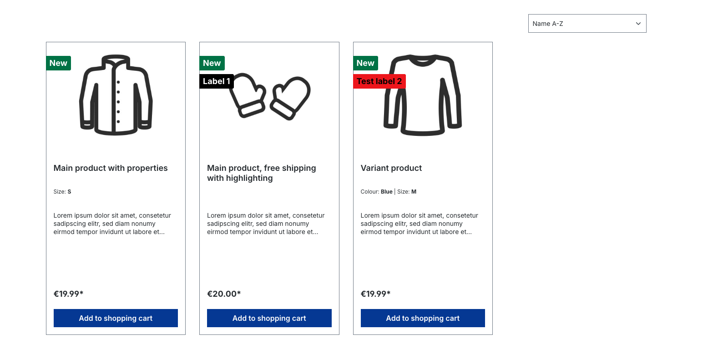
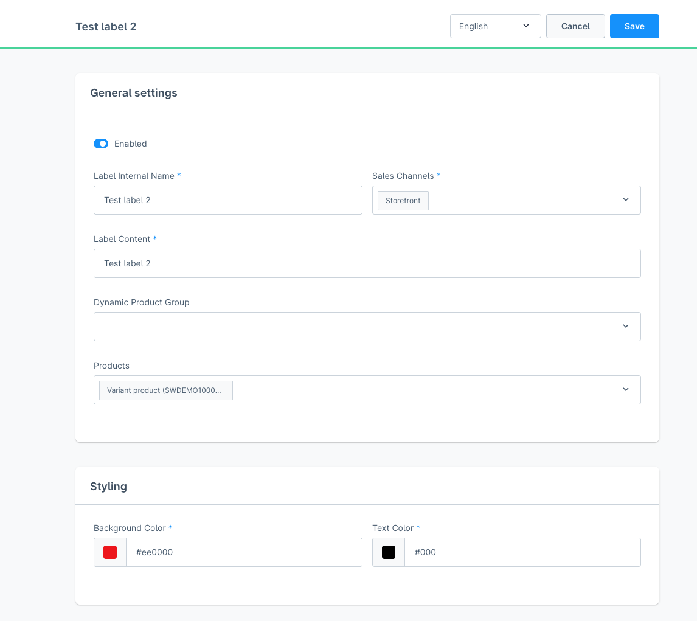
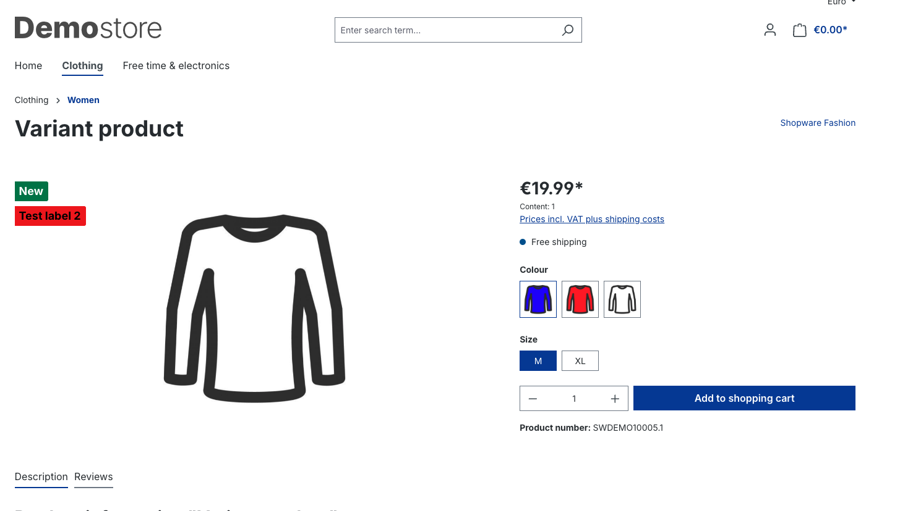

# Sidworks Product Labels for Shopware 6
This plugin adds custom product labels to the storefront of Shopware 6. You can attach multiple labels to multiple products by Product groups or custom product selection

## Images




## Installation
```bash
composer require sidworks/sw-plugin-product-labels
bin/console plugin:refresh
bin/console plugin:install --activate SidworksProductLabels
```

## Todo
- Add option to use {{ product.variable }} in content of label
- Make scheduler work
- Bulk delete in admin
